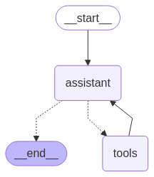
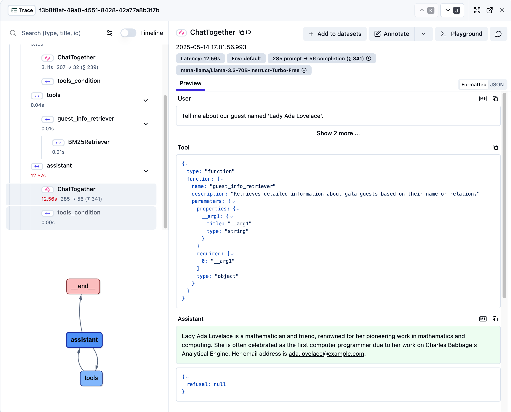

# Agentic Retrieval Augmented Generation: Building the Guestbook Tool With Web Search Capability

We’ll create a custom tool that Alfred can use to quickly retrieve guest information during the gala. Let’s break this down into three manageable steps:

Load and prepare the dataset
Create the Retriever Tool
Integrate the Tool with Alfred

